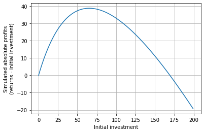

# Arbitrator
#### *An arbitrage calculator adapted to the modern age of cryto automated market maketrs.*

Requirements:

`Python>=3.8,
scipy==1.8.0`

Arbitrator is a 100% free library useful to recognize and simulate arbitrage opportunities
in both normal Forex-like exange types and AMM exchanges living in the blockchain. It is intended for research but it can be easily adapted into a live trading system. Check this simple example:


```python
from trading_arbitrator.arbitrator import Arbitrator

pairs = [
    ["A", "B"],
    ["A", "C"],
    ["B", "C"]
]

rates = [
    1.2,
    1.11,
    0.57,
]

arb = Arbitrator(pairs=pairs, rates=rates, initial_assets=["A"])
loops = arb.get_loops(sizes=[3])
for l in loops:
    print(l, "Return:", round(l.convert(amount=1), 2))
```

    A/C -> B/C -> A/B Return: 1.62
    A/B -> B/C -> A/C Return: 0.62
    

A Loop represents a series of swaps that start and end with the same asset:


```python
loop = loops[0]
print("Our initial asset is:", loop.initial_asset)
print("It has", loop.size, "swaps, so it represents a triangular arbitrage!")
print("Starting with 500 units of it, we get:", loop.convert(amount = 500))
```

    Our initial asset is: A
    It has 3 swaps, so it represents a triangular arbitrage!
    Starting with 500 units of it, we get: 811.4035087719299
    

The system can do more than triangular arbitrages:


```python
pairs = [["A", "B"],["A", "C"],["B", "C"],["C", "D"],["D", "A"],["B", "D"]]

rates = [1.,2.,3.,0.7,0.9,2]

arb = Arbitrator(pairs=pairs, rates=rates, initial_assets=["A", "B"])
loops = arb.get_loops(sizes=[2,3,4,5])
for l in loops[:4]:  # Reduce the output
    print(l, "Return:", round(l.convert(amount=1), 2))
```

    A/B -> B/C -> C/D -> D/A Return: 1.89
    B/C -> C/D -> D/A -> A/B Return: 1.89
    A/B -> B/D -> D/A Return: 1.8
    B/D -> D/A -> A/B Return: 1.8
    

## Liquidity Pools and blockchain exchanges:
Arbitrator can simulate liquidity pools and their exchange functions, such as uniswap's constant product market maker, with more than 2 assets:


```python

from trading_arbitrator.primitives import Pool, Converter
from trading_arbitrator.amm import constant_product_amm, constant_sum_amm

# First we instantiate the rules of exchange:
converter = Converter(name="CPAMM", conversion_formula=constant_product_amm, fee=5) # Fee is in %, so 5%
# Now we can create a pool:
pool = Pool(name="pool1", assets=["A", "B", "C"], amounts=[500,400,200], converter=converter)
```

This `Pool` represents 3 assets, A, B and C, in a liquidity pool where 500 units of A, 400 units of B and 200 units of C are present. They can be swapped for each other following the rules of a constant product market maker, as configured in the converter. This can then be fed to the Arbitrator:


```python
arb = Arbitrator(pools=[pool], initial_assets=["A"])
loops = arb.get_loops(sizes=[3])
for l in loops:
    print(l, "Return:", round(l.convert(amount=1, with_fees=True), 20))
```

    A/B ex: pool1 -> B/C ex: pool1 -> A/C ex: pool1 Return: 0.8575418868941085
    A/C ex: pool1 -> B/C ex: pool1 -> A/B ex: pool1 Return: 0.8575418868941085
    

Since we have only one `Pool` and the CFMM function is independent of the path, we get exactly the same result for both loops, which should be 1 without the 5% per swap fee applied. Let's check it out with more than one pool:


```python
pool1 = Pool(name="pool1", assets=["A", "B", "C"], amounts=[500,400,200], converter=converter)
pool2 = Pool(name="pool2", assets=["A", "B", "C", "D"], amounts=[500,400,300, 200], converter=converter)
pool3 = Pool(name="pool3", assets=["A", "B"], rate=1.5)
```

Now we have three pools, one like the previous one, another with 4 assets, and a third one with a constant rate of exchange and no fees, so it doesn't need a converter. Let's get some loops, and let's imagine we can initiate arbitrages with A and C:


```python
arb = Arbitrator(pools=[pool1, pool2, pool3], initial_assets=["A", "D"])
loops = arb.get_loops(sizes=[2,3,4,5])
for l in loops[:8]:  # Reduce the output
    print(l, "Return:", round(l.convert(amount=1), 2))
```

    A/B ex: pool3 -> B/C ex: pool2 -> A/C ex: pool1 Return: 2.52
    A/C ex: pool2 -> A/C ex: pool1 -> A/B ex: pool3 -> A/B ex: pool2 Return: 2.39
    A/B ex: pool3 -> A/B ex: pool2 -> A/C ex: pool2 -> A/C ex: pool1 Return: 2.39
    A/B ex: pool3 -> B/D ex: pool2 -> C/D ex: pool2 -> A/C ex: pool1 Return: 2.39
    A/B ex: pool3 -> B/C ex: pool2 -> B/C ex: pool1 -> A/B ex: pool1 Return: 2.39
    A/C ex: pool2 -> A/C ex: pool1 -> A/B ex: pool3 -> A/B ex: pool1 Return: 2.38
    A/B ex: pool3 -> A/B ex: pool1 -> A/C ex: pool2 -> A/C ex: pool1 Return: 2.37
    A/B ex: pool3 -> B/C ex: pool2 -> B/C ex: pool1 -> A/B ex: pool2 Return: 2.37
    

We can check the state of the LPs before and after running the loop:


```python
print("Pool1 state:", pool1.amounts)
print("Pool2 state:", pool2.amounts)
print("Pool3 state:", pool3.amounts)

loop = loops[0]
loop.convert(amount=50, reset=False)  # Pass reset=False to not reset pool states after a conversion

print("After the conversion:")
print("Pool1 state:", pool1.amounts)
print("Pool2 state:", pool2.amounts)
print("Pool3 state:", pool3.amounts)
```

    Pool1 state: [500, 400, 200]
    Pool2 state: [500, 400, 300, 200]
    Pool3 state: None
    After the conversion:
    Pool1 state: [408.16326530612247, 400, 245.0]
    Pool2 state: [500, 475.0, 252.6315789473684, 200]
    Pool3 state: None
    

## Different AMM algorithms
Arbitrator can use any algorithm for swaps that can be put in the format of a function with the following arguments:
- i: index of starting coin.
- j: index of target coin.
- am: amount of starting coin to trade for target coin.
- state: list of pool sizes, to be updated by this function.

Where the indexes refer to the list of assets, as seen when defininf a `Pool` object. For example, this is the implementation of the constant product market maker algorithm:


```python
def constant_product_amm(i, j, am, state):
    """
    Implements prod(x_i) = C, where x_i are the amounts of i coins in the pool,
    and C a constant. Constant product automated market maker.

    :param i: index of starting coin
    :param j: index of target coin
    :param am: amount of starting coin to trade for target coin
    :param state: list of pool sizes
    :return: amount of target asset to be sent to trader
    """
    initial_j = state[j]
    # We get the constant C
    c = math.prod(state)
    # We add "am" quantity of coin i to the pool:
    state[i] += am
    prod_no_j = math.prod(state[:j]+state[j+1:])
    final_j = c / prod_no_j
    # We write the new amount of j
    state[j] = final_j
    return initial_j - final_j
```

Any function following this pattern can be coded and used with the Converter object.
Constant sum market maker, for stablecoin swapping, is implemented too alongside constant product market maker, and will throw
an exception if any pool is emptied.
In a future update Curve's StableSwap algorithm will be included.

## Finding the right amount to trade accounting for slippage

Slippage may be a real problem with many pools as they may be very unbalanced or not very well filled. This means that the absolute profitability of an arbitrage will have a maximum when slippage is too much and starts overcoming the basic returns of the arbitrage. Since Arbitrator can simulate liquidity pools the conversion formula can be sampled to better understand what's the optimal amount of investment:


```python
import matplotlib.pyplot as plt

best_loop = loops[0]
print("Loop starts with asset", best_loop.initial_asset, "and consists of:", best_loop)
results = []
for i in range(0,200):
    results.append(best_loop.convert(i) - i)  # Return minus investment for absolute profits

print(best_loop.get_max_absolute_profit())  # Finds the maximum profits, returning (<investment>, <absolute profits>)
plt.plot(results)
plt.xlabel("Initial investment")
plt.ylabel("Simulated absolute profits\n(returns - initial investment)")
plt.grid()
plt.show()
```

    Loop starts with asset A and consists of: A/B ex: pool3 -> B/C ex: pool2 -> A/C ex: pool1
    Optimization terminated successfully.
             Current function value: -38.695190
             Iterations: 29
             Function evaluations: 58
    (65.2314453125001, 38.69518978010167)
    


    

    


So, given the state of the pools, the best compromise between returns and slippage happens when investing 65 units of asset A, which should yield an absolute profit of 38 units of A, on top of the 65 already invested.

This is a great way of finding out if the slippage is going to play a factor in an arbitrage. In a real life scenario this would mean that there is no point on inveting more than 65 units of A, since, best case scenario, we're the only ones trading these pools in this block (or, since the pool data was gathered), and that's the maximum absolute profit we'll get. If more people trade these pools, then we risk hitting this slippage barrier even sooner.
